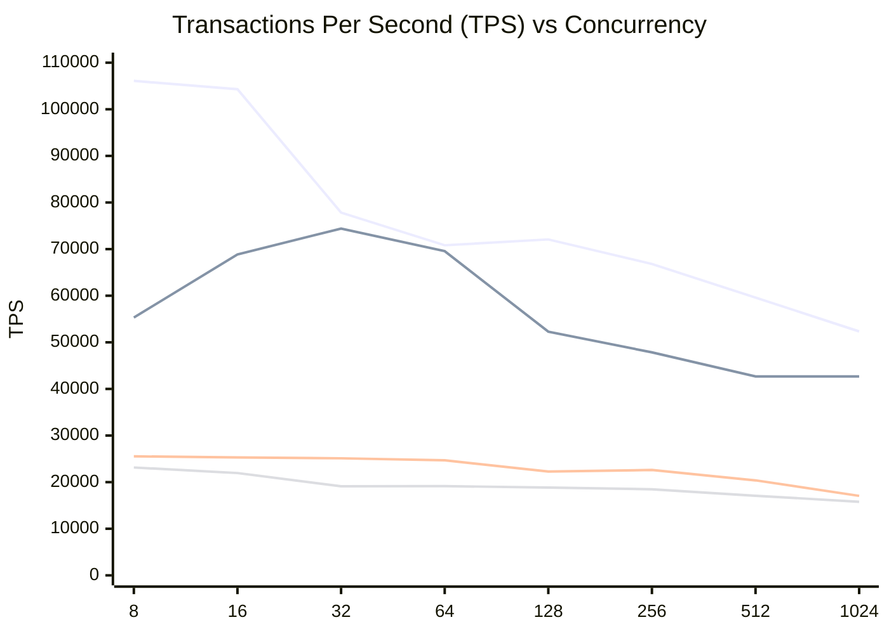
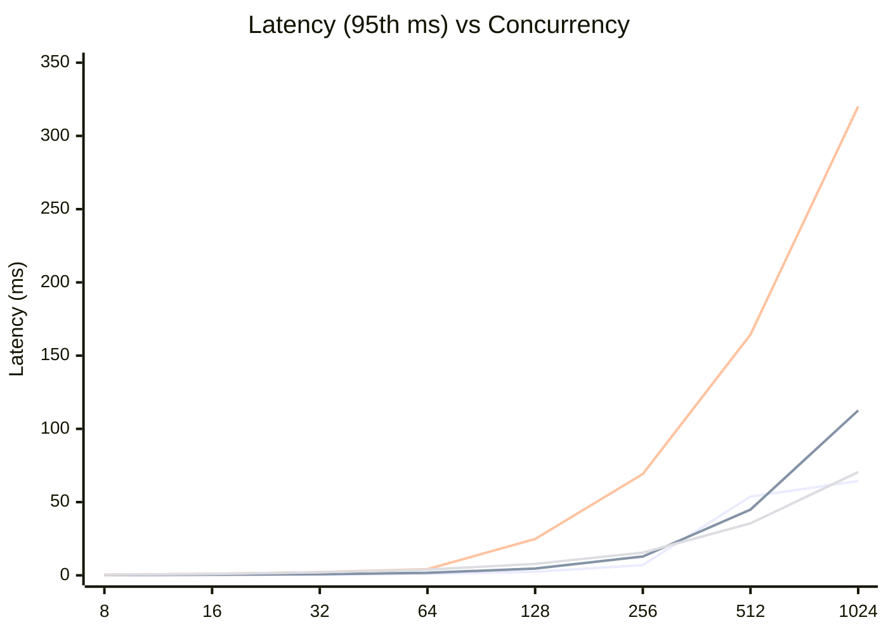

# Benchmark Report: OLTP Point Select

**Date:** Thursday, March 12, 2026  
**Workload:** `oltp_point_select` (Sysbench)  
**Proxy Configuration:** ProxySQL (both 1 and 4 thread versions) and PgBouncer are configured with a **maximum of 40 backend connections** to the database.

This report compares the performance of four different PostgreSQL access layers for the highly concurrent `oltp_point_select` workload:
1. **PostgreSQL Direct**: Baseline direct access (8 CPUs).
2. **ProxySQL (Standard)**: Multi-threaded proxy (4 CPUs, 4 threads).
3. **ProxySQL (Single Core)**: Single-threaded proxy (1 CPU, 1 thread).
4. **PgBouncer**: Single-threaded connection pooler (1 CPU).

## 1. Performance Comparison (TPS/QPS)

Since Point Select is a single-statement transaction, TPS and QPS are equal.

| Concurrency | Postgres (8) | ProxySQL (4) | ProxySQL-S (1) | PgBouncer (1) |
|-------------|--------------|--------------|----------------|---------------|
| 8           | 106098.18    | 55321.27     | 25534.38       | 23142.26      |
| 16          | 104311.67    | 68857.05     | 25296.37       | 21950.47      |
| 32          | 77829.59     | 74403.71     | 25116.04       | 19119.05      |
| 64          | 70820.02     | 69561.11     | 24689.08       | 19148.10      |
| 128         | 72078.85     | 52286.04     | 22264.55       | 18832.98      |
| 256         | 66804.34     | 47844.74     | 22601.68       | 18468.27      |
| 512         | 59606.36     | 42677.74     | 20383.79       | 17085.21      |
| 1024        | 52338.89     | 42693.40     | 17055.42       | 15793.68      |

### TPS Diagram (Mermaid)

**Legend (Order of appearance):**
1. **PostgreSQL Direct** (Top line at low concurrency)
2. **ProxySQL (Standard)** (Middle line, scales up at 32)
3. **ProxySQL (Single Core)** (Bottom-middle)
4. **PgBouncer** (Bottom-most line)

## 2. Latency Analysis (95th percentile, ms)

| Concurrency | Postgres | ProxySQL (4) | ProxySQL-S (1) | PgBouncer |
|-------------|----------|--------------|----------------|-----------|
| 8           | 0.09     | 0.20         | 0.46           | 0.45      |
| 16          | 0.23     | 0.37         | 1.03           | 0.97      |
| 32          | 0.53     | 0.74         | 2.18           | 2.14      |
| 64          | 1.06     | 1.70         | 4.25           | 3.89      |
| 128         | 2.35     | 4.65         | 24.83          | 7.84      |
| 256         | 7.04     | 12.98        | 69.29          | 15.55     |
| 512         | 53.85    | 44.98        | 164.45         | 35.59     |
| 1024        | 64.47    | 112.67       | 320.17         | 70.55     |

### Latency Diagram (Mermaid)

**Legend (Order of appearance):**
1. **PostgreSQL Direct** (Lowest latency at low concurrency)
2. **ProxySQL (Standard)** (Scaling latency)
3. **ProxySQL (Single Core)** (Highest latency)
4. **PgBouncer** (Competitive with ProxySQL-Standard at high concurrency)

## Observations

1. **Efficiency at Low Concurrency**: PostgreSQL direct is unbeatable at low concurrency for point selects, maintaining sub-millisecond latency.
2. **ProxySQL Scaling**: Standard ProxySQL (4 threads) scales remarkably well, catching up to direct PostgreSQL at **32 concurrent users** (74k vs 77k TPS) and providing comparable performance thereafter.
3. **Threading Advantage**: ProxySQL Standard (multi-threaded) provides **~2.5x more throughput** than PgBouncer or Single-thread ProxySQL for this specific high-volume workload.
4. **Latency Ceiling**: For very high concurrency (512+), direct PostgreSQL starts to struggle with internal synchronization, while ProxySQL Standard and PgBouncer manage to smooth out the latency spike somewhat (Postgres 53ms vs ProxySQL 44ms at 512).
