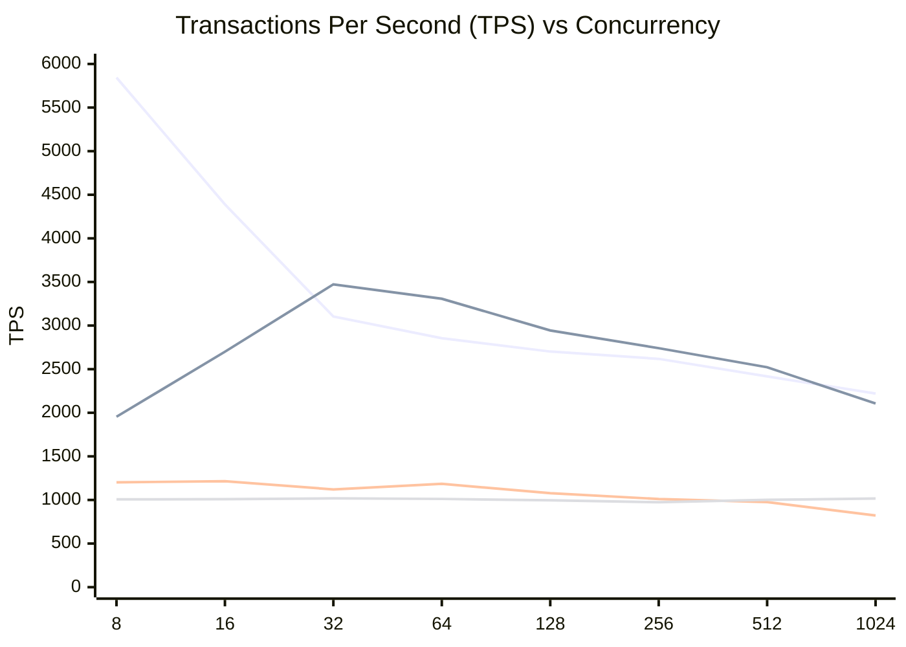
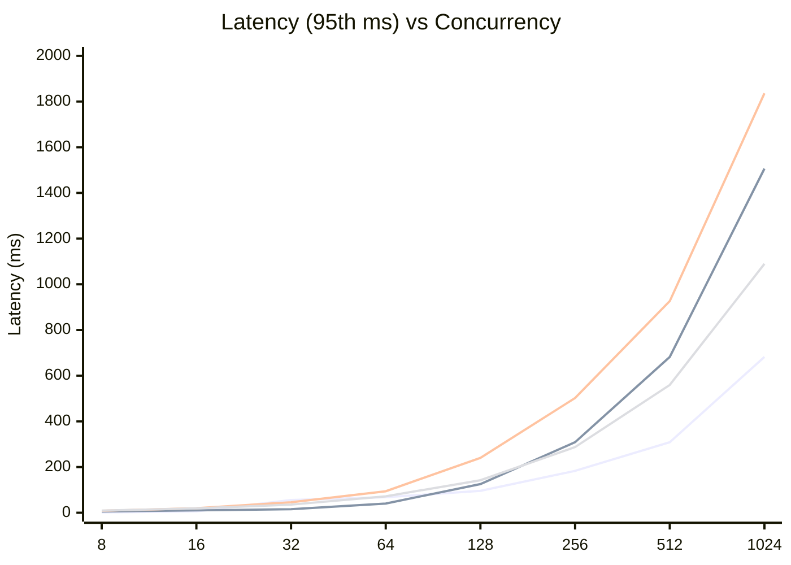

# Benchmark Report: OLTP Read Only

**Date:** Thursday, March 12, 2026  
**Workload:** `oltp_read_only` (Sysbench)  
**Proxy Configuration:** ProxySQL (both 1 and 4 thread versions) and PgBouncer are configured with a **maximum of 40 backend connections** to the database.

This report compares the performance of four different PostgreSQL access layers:
1. **PostgreSQL Direct**: Baseline direct access (8 CPUs).
2. **ProxySQL (Standard)**: Multi-threaded proxy (4 CPUs, 4 threads).
3. **ProxySQL (Single Core)**: Single-threaded proxy (1 CPU, 1 thread).
4. **PgBouncer**: Single-threaded connection pooler (1 CPU).

## 1. Performance Comparison (TPS)

| Concurrency | Postgres (8) | ProxySQL (4) | ProxySQL-S (1) | PgBouncer (1) |
|-------------|--------------|--------------|----------------|---------------|
| 8           | 5844.66      | 1954.52      | 1202.34        | 1007.69       |
| 16          | 4390.74      | 2700.00      | 1215.43        | 1009.81       |
| 32          | 3104.08      | 3473.35      | 1121.94        | 1018.58       |
| 64          | 2855.54      | 3307.60      | 1185.44        | 1012.20       |
| 128         | 2702.38      | 2944.64      | 1078.53        | 996.95        |
| 256         | 2618.78      | 2741.76      | 1011.43        | 974.22        |
| 512         | 2417.82      | 2522.10      | 976.65         | 1001.81       |
| 1024        | 2220.13      | 2106.22      | 822.09         | 1017.11       |

### TPS Diagram (Mermaid)

**Legend (Order of appearance):**
1. **PostgreSQL Direct** (Highest TPS at low concurrency)
2. **ProxySQL (Standard)** (Crosses Postgres at 32, maintains high throughput)
3. **ProxySQL (Single Core)** (Bottom-middle)
4. **PgBouncer** (Bottom-most line)

## 2. Latency Analysis (95th percentile, ms)

| Concurrency | Postgres | ProxySQL (4) | ProxySQL-S (1) | PgBouncer |
|-------------|----------|--------------|----------------|-----------|
| 8           | 1.70     | 5.67         | 8.90           | 9.22      |
| 16          | 6.21     | 10.27        | 19.65          | 19.29     |
| 32          | 55.82    | 15.55        | 45.79          | 35.59     |
| 64          | 68.05    | 40.37        | 94.10          | 71.83     |
| 128         | 95.81    | 125.52       | 240.02         | 142.39    |
| 256         | 183.21   | 308.84       | 502.20         | 287.38    |
| 512         | 308.84   | 682.06       | 926.33         | 559.50    |
| 1024        | 682.06   | 1506.29      | 1836.24        | 1089.30   |

### Latency Diagram (Mermaid)

**Legend (Order of appearance):**
1. **PostgreSQL Direct** (Lowest latency initially)
2. **ProxySQL (Standard)** (Lowest latency at 32 concurrency)
3. **ProxySQL (Single Core)** (Highest latency)
4. **PgBouncer** (Intermediate latency)

## Observations

1. **Peak Throughput**: ProxySQL (4 threads) achieved its peak TPS at **32 concurrent users**, significantly outperforming direct Postgres (at that specific concurrency level) by managing connection overhead efficiently.
2. **Scalability**: Standard ProxySQL (multi-threaded) maintains higher throughput than PgBouncer and ProxySQL-Single as concurrency increases beyond 32 threads.
3. **Connection Pooling Benefit**: Direct PostgreSQL performance dropped by over **50%** when scaling from 8 to 16+ connections (due to its low configured CPU affinity or context switching overhead), while ProxySQL smoothed the curve.
4. **Latency**: At extreme concurrency (1024), PgBouncer maintained the lowest latency among the proxies, while standard ProxySQL prioritized throughput.
