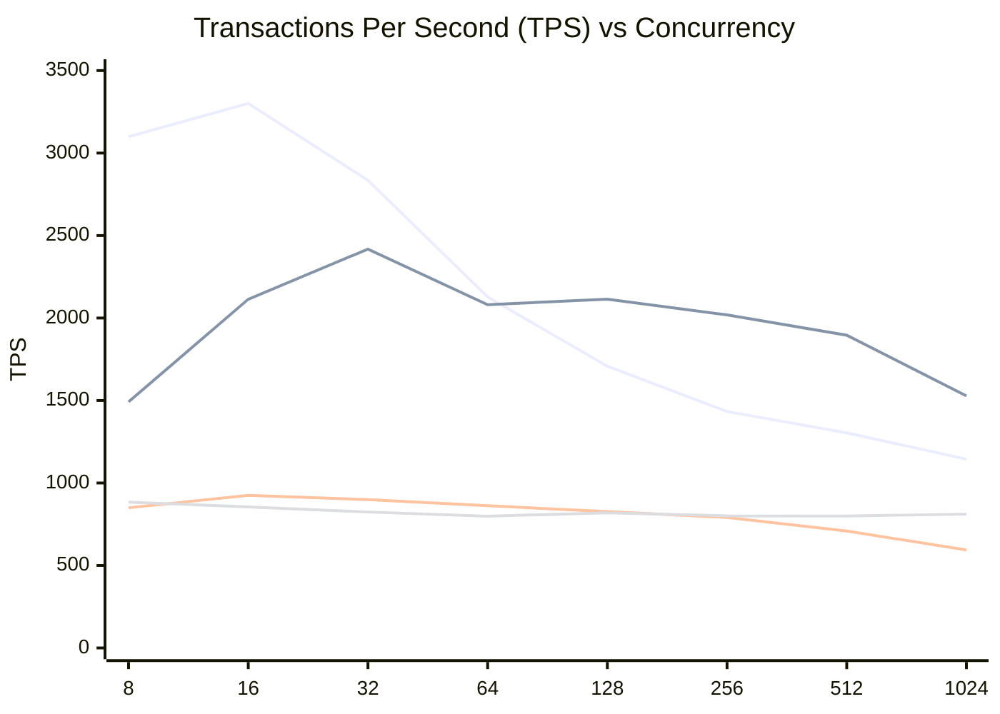
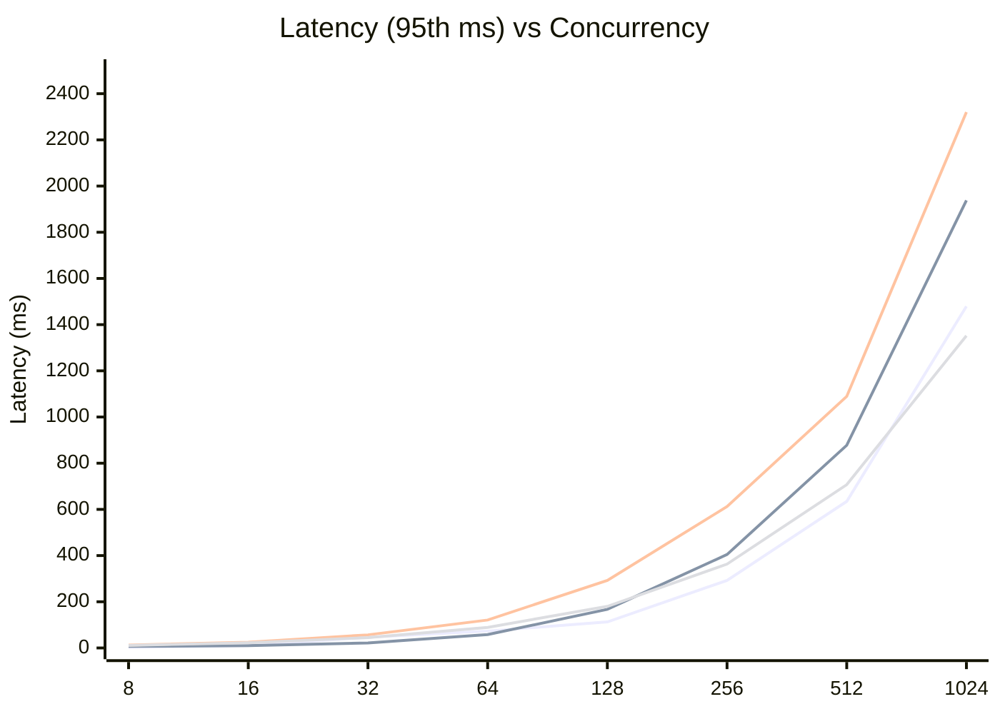

# Benchmark Report: OLTP Read Write

**Date:** Friday, March 13, 2026  
**Workload:** `oltp_read_write` (Sysbench)  
**Proxy Configuration:** ProxySQL (both 1 and 4 thread versions) and PgBouncer are configured with a **maximum of 40 backend connections** to the database.

This report compares the performance of four different PostgreSQL access layers for a mixed read-write workload:
1. **PostgreSQL Direct**: Baseline direct access (8 CPUs).
2. **ProxySQL (Standard)**: Multi-threaded proxy (4 CPUs, 4 threads).
3. **ProxySQL (Single Core)**: Single-threaded proxy (1 CPU, 1 thread).
4. **PgBouncer**: Single-threaded connection pooler (1 CPU).

## 1. Performance Comparison (TPS)

| Concurrency | Postgres (8) | ProxySQL (4) | ProxySQL-S (1) | PgBouncer (1) |
|-------------|--------------|--------------|----------------|---------------|
| 8           | 3099.91      | 1492.42      | 850.91         | 884.34        |
| 16          | 3301.26      | 2114.42      | 925.05         | 855.68        |
| 32          | 2835.71      | 2418.59      | 899.41         | 824.00        |
| 64          | 2128.03      | 2081.04      | 862.94         | 799.79        |
| 128         | 1708.68      | 2114.90      | 827.27         | 819.89        |
| 256         | 1433.75      | 2019.47      | 791.56         | 801.60        |
| 512         | 1304.82      | 1896.43      | 709.92         | 800.56        |
| 1024        | 1144.58      | 1528.53      | 594.75         | 811.70        |

### TPS Diagram (Mermaid)

**Legend (Order of appearance):**
1. **PostgreSQL Direct** (Highest initially, drops sharply after 32)
2. **ProxySQL (Standard)** (Beats Postgres after 64 concurrency)
3. **ProxySQL (Single Core)** (Bottom-middle)
4. **PgBouncer** (Extremely stable ~800 TPS baseline)

## 2. Latency Analysis (95th percentile, ms)

| Concurrency | Postgres | ProxySQL (4) | ProxySQL-S (1) | PgBouncer |
|-------------|----------|--------------|----------------|-----------|
| 8           | 3.13     | 6.67         | 12.52          | 11.04     |
| 16          | 10.27    | 10.27        | 24.83          | 22.69     |
| 32          | 46.63    | 21.50        | 56.84          | 44.98     |
| 64          | 73.13    | 57.87        | 121.08         | 89.16     |
| 128         | 112.67   | 167.44       | 292.60         | 179.94    |
| 256         | 292.60   | 404.61       | 612.21         | 363.18    |
| 512         | 634.66   | 877.61       | 1089.30        | 707.07    |
| 1024        | 1479.41  | 1938.16      | 2320.55        | 1352.03   |

### Latency Diagram (Mermaid)

**Legend (Order of appearance):**
1. **PostgreSQL Direct**
2. **ProxySQL (Standard)**
3. **ProxySQL (Single Core)**
4. **PgBouncer**

## Observations

1. **ProxySQL Throughput Dominance**: At high concurrency (128+), **ProxySQL (Standard)** significantly outperforms direct PostgreSQL by maintaining throughput (~2100 TPS vs ~1700 TPS at 128), demonstrating its superior handling of connection contention in mixed workloads.
2. **PostgreSQL Scaling Limit**: Direct PostgreSQL throughput peaks at 16 concurrent users and begins a steady decline as concurrency increases, likely due to lock contention and process management overhead.
3. **PgBouncer Stability**: PgBouncer shows remarkable consistency, holding a steady ~800 TPS from 8 to 1024 connections, though it lacks the peak throughput capacity of multi-threaded ProxySQL.
4. **Latency Sweet Spot**: ProxySQL (Standard) achieved the lowest 95th percentile latency at **32 concurrent users** (21.5ms), even beating direct PostgreSQL (46.6ms) at that specific concurrency level.
5. **Resource Efficiency**: Single-threaded ProxySQL and PgBouncer perform similarly in this workload, but ProxySQL Standard's multi-threading allows it to leverage the available CPU more effectively to drive 2-3x higher TPS.
