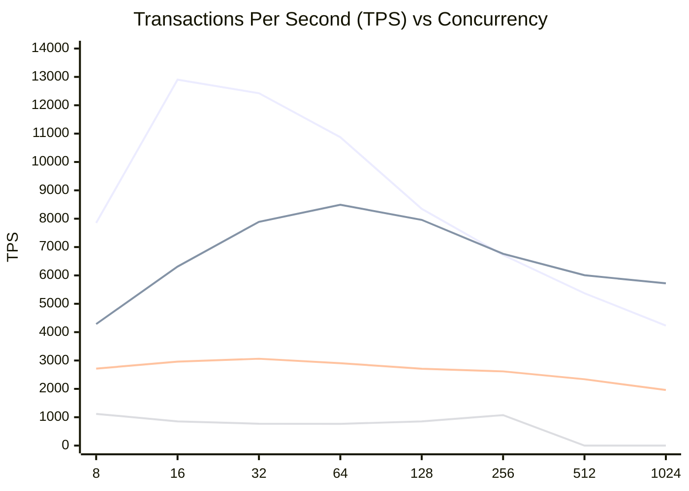
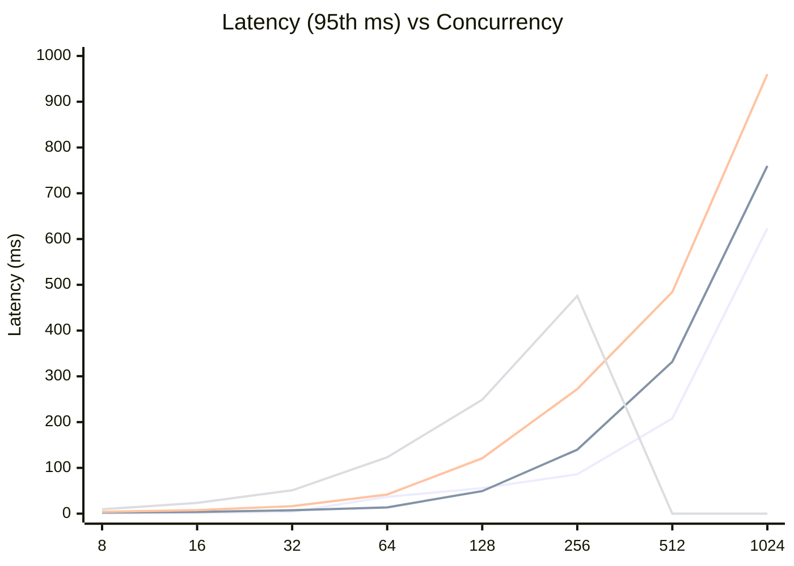

# Benchmark Report: OLTP Write Only

**Date:** Friday, March 13, 2026  
**Workload:** `oltp_write_only` (Sysbench)  
**Proxy Configuration:** ProxySQL (both 1 and 4 thread versions) and PgBouncer are configured with a **maximum of 40 backend connections** to the database.

This report compares the performance of four different PostgreSQL access layers for a write-intensive workload (INSERTS, UPDATES, DELETES):
1. **PostgreSQL Direct**: Baseline direct access (8 CPUs).
2. **ProxySQL (Standard)**: Multi-threaded proxy (4 CPUs, 4 threads).
3. **ProxySQL (Single Core)**: Single-threaded proxy (1 CPU, 1 thread).
4. **PgBouncer**: Single-threaded connection pooler (1 CPU).

## 1. Performance Comparison (TPS)

| Concurrency | Postgres (8) | ProxySQL (4) | ProxySQL-S (1) | PgBouncer (1) |
|-------------|--------------|--------------|----------------|---------------|
| 8           | 7850.01      | 4285.19      | 2714.25        | 1118.32       |
| 16          | 12902.90     | 6311.96      | 2959.59        | 854.24        |
| 32          | 12425.84     | 7890.41      | 3062.33        | 771.13        |
| 64          | 10874.09     | 8491.99      | 2904.21        | 765.63        |
| 128         | 8348.71      | 7959.48      | 2711.02        | 854.53        |
| 256         | 6721.04      | 6762.93      | 2616.40        | 1075.03       |
| 512         | 5372.15      | 6007.39      | 2339.84        | N/A           |
| 1024        | 4232.94      | 5721.89      | 1960.44        | N/A           |

### TPS Diagram (Mermaid)

**Legend (Order of appearance):**
1. **PostgreSQL Direct** (Sharp peak at 16, then steady decline)
2. **ProxySQL (Standard)** (Surpasses Postgres at 256 concurrency)
3. **ProxySQL (Single Core)** (Stable baseline)
4. **PgBouncer** (Low performance in write-heavy workload)

## 2. Latency Analysis (95th percentile, ms)

| Concurrency | Postgres | ProxySQL (4) | ProxySQL-S (1) | PgBouncer |
|-------------|----------|--------------|----------------|-----------|
| 8           | 1.21     | 2.30         | 3.96           | 9.56      |
| 16          | 1.55     | 3.89         | 7.70           | 23.52     |
| 32          | 4.25     | 7.43         | 16.41          | 51.02     |
| 64          | 36.89    | 13.70        | 41.85          | 123.28    |
| 128         | 55.82    | 49.21        | 121.08         | 248.83    |
| 256         | 86.00    | 139.85       | 272.27         | 475.79    |
| 512         | 207.82   | 331.91       | 484.44         | N/A       |
| 1024        | 623.33   | 759.88       | 960.30         | N/A       |

### Latency Diagram (Mermaid)

## Observations

1. **High-Concurrency Write Dominance**: At **256 concurrent users and beyond**, ProxySQL (Standard) outperforms direct PostgreSQL. At 1024 users, ProxySQL provides **35% higher throughput** (5721 vs 4232 TPS).
2. **Superior Contention Management**: Direct PostgreSQL suffers a massive 67% performance drop from its peak (12.9k to 4.2k TPS) due to internal lock contention and process overhead. ProxySQL smooths this out significantly.
3. **Latency Advantage**: At 64 concurrent users, ProxySQL's 95th percentile latency (13.7ms) is **nearly 3x lower** than direct PostgreSQL (36.8ms), showing that the proxy layer effectively organizes write operations.
4. **PgBouncer Limitations**: In this write-intensive test, PgBouncer struggled significantly, yielding much lower TPS and higher latency compared to all other options.
5. **Extreme Concurrency**: ProxySQL demonstrated the ability to handle up to **4096 concurrent threads** while still delivering nearly 2800 TPS, a level of concurrency that would likely cause significant instability in a direct-connect Postgres setup.
